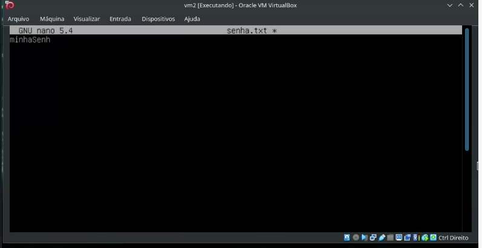
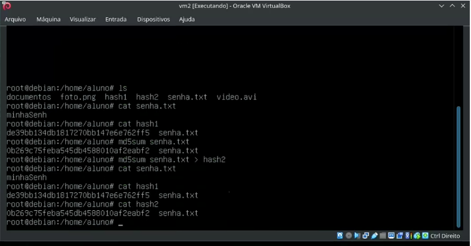

## Vai cair na prova: 

- noções basicas de conexões com o netcat
- criando um chat simples usando netcat
- transferindo arquivos entre dois hosts usando netcat

Primeiro vamos iniciar criando um arquivo senha.txt, e inserir um texto escrito "minhaSenha" no arquivo senha.txt, segue a foto:
 

 Podemos verificar a origem do arquivo usando o Hash com o comando md5sum --> foto1:
 

Por exemplo se eu alterar para "minhaSenha1" o hash vai ser diferente -> vide foto 2:
 

 Podemos criar uma comunicação "chat" entre os dois também utilizando o netcat, como por exemplos nas fotos 2, cliente e servidor abaixo:

- Lado do Cliente (é o lado que deve iniciar a comunicação):
 

- Lado do Servidor:
 

Todo arquivo por trás tem um calculado matematico como por exemplo o hash

- se eu criar um foto ele tem um hash; se eu criar um txt ele tem um hash, se eu criar em formato avi ele também tem hash

No Windowns não é possível tirar hash, no linux é possível hash, e no Mac o professor disse que não sabe.

- Primeiro vou ver qual o hash e dps vou salvar a info em um arquivo:
 

- F
 

- F
 

- F
 

- transferindo arquivos e verificando hash, exemplo do professor (lado cliente):
 

- transferindo arquivos e verificando hash, exemplo do professor (lado servidor):
 

