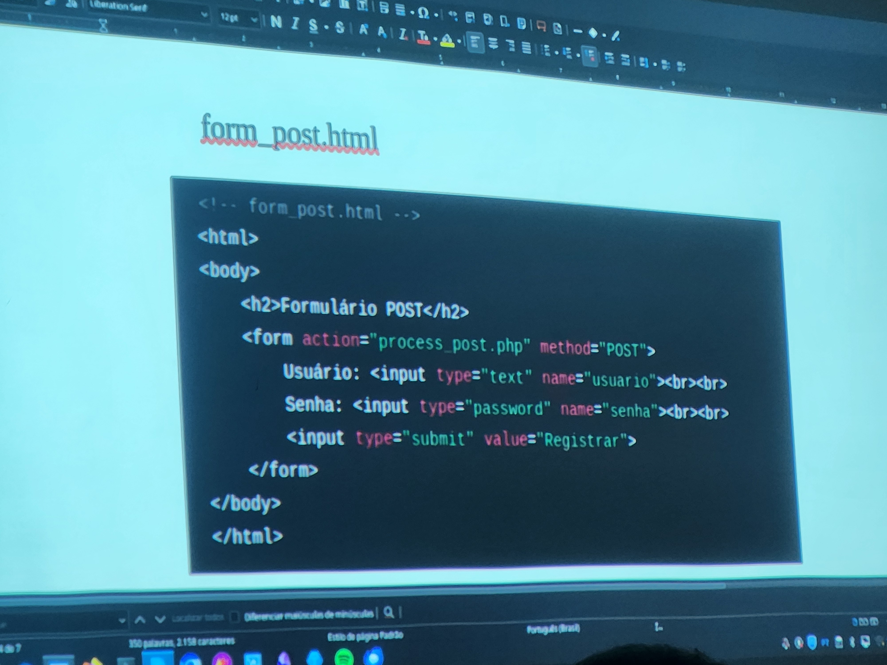

##  Aula pós checkpoint 4

1. MAQUINA KALI <br>
    a) Configs: eth0 (NAT), eth1 (INT - 192.168.10.20)

2. MAQUINA VM2 <br>
    a) Configs: (NAT), (INT) e (Loopback - 127.0.0.1)

3. MAQUINA VM3 <br>
    a) Configs: (enp0s8 - 172.16.10.10)

Comentários do professor:
- As redes NAT eram apenas para conectar-se a INTERNET.
- Quando fazemos `ssh -L 222:localhost:80` estamos comunicando com a loopback.
- Não iremos conseguir bypassar da Kali para vm3 sem utilizar a vm2 de proxy.


## SEGUNDA PARTE DA AULA 

Iremos aprender as vulnerabilidades do método GET

Na vm2:

- apt update
- php -v
no caso não tem instalado precisamos instalar utilizando o comando sudo `apt install php7.4 libapache2-mod-php7.4`

agora dá para usar o `php -v`

agora, o professor pediu para retirar o `index.html` e adiciona o `form_get.html` e digita o codigo que ele passou no slide:

`cd /var/www/html`
excluir o index usando o comando `rm index.html`
criar o arquivo `form_get.html` e digigar o html do slide

```

```

dps de salvar o arquivo que foi digitado e dps criar no mesmo diretorio html criar o arquivo `process_get.php` copiando o arquivo que o professor passou tambem

```
<!-- process_get.php -->
<?php
    $nome = $_GET['nome'];
    $email = $_GET['email'];

    echo "<h2>Dados Recebidos via GET</h2>"
    echo "Nome: " . htmlspecialchars($nome) . "<br>";
    echo "Email: " . htmlspecialchars($email) . "<br>";
?>


```
ao abrir no kali o ip 192.168.10.20 e entrar no arquivo que eu criei, e digitar um nome e um email, percebo que existe uma falha na URL, porque o nome que eu digitei e o email está sendo demonstrado na URL

Depois de denmonstrar essa falha o professor pediu para mover os dois arquivos que criamos para pastar anterior no caso a pasta /var/www utlizando os comandos:

x mv form_get.html  /var/www
x mv process_get.php  /var/www

Dps de fazer isso vamos entrar na pasta html e criar o arquivo `form_post.html` 



